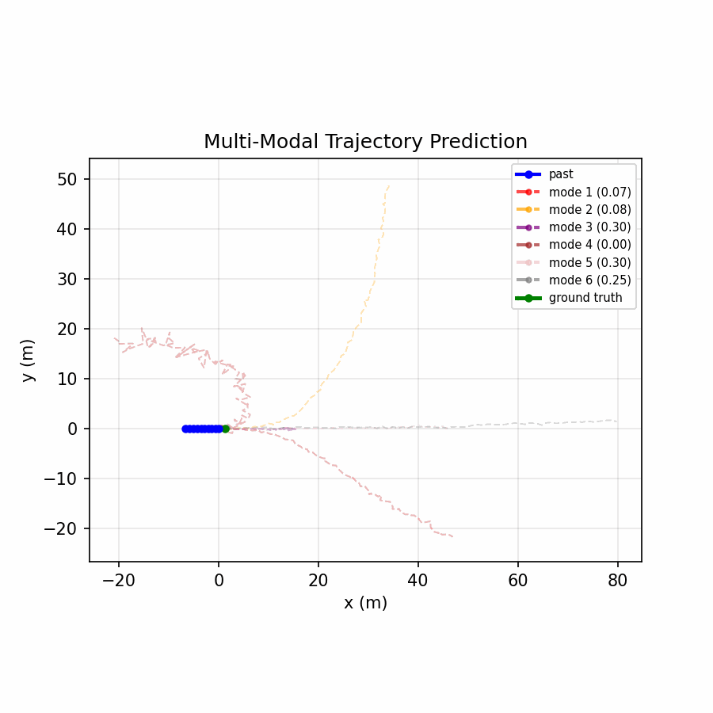
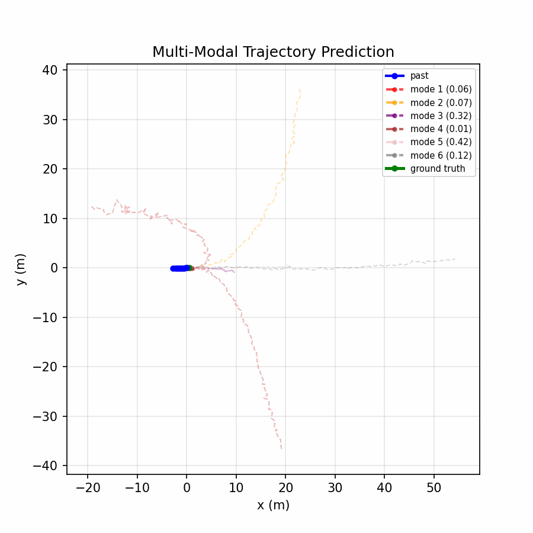
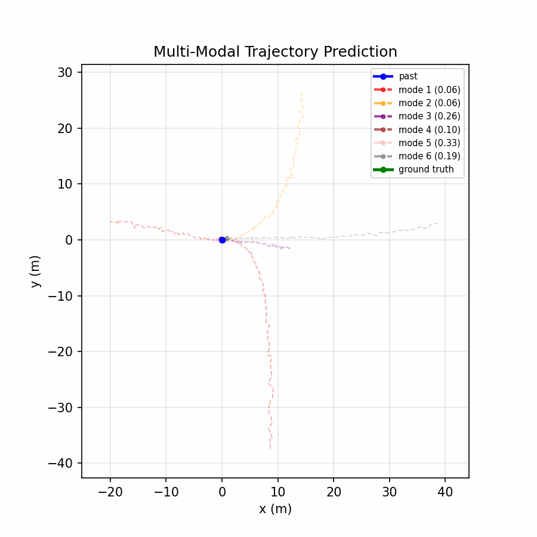

# Waymo Motion Prediction Model

## Project Overview

This project implements a trajectory prediction model using the Waymo Open Motion Dataset, aiming to predict an agent's future positions based on its past trajectory. The model takes the past 10 (x, y) coordinates of a single agent and predicts its next 80 positions (a future horizon of roughly 8 seconds at 10 Hz). This task is crucial for autonomous driving systems, as accurate motion forecasting of vehicles and pedestrians helps in planning and safety. The provided code serves as a baseline approach: it trains a simple deep learning model on a subset of the Waymo motion dataset and evaluates its performance using standard error metrics. The model works on individual agent tracks without any scene context or map information, demonstrating what can be achieved with purely historical trajectory data.

See Techincal Report Here 


Key features of the project include:

- **Data Loading & Preprocessing:** Reading Waymo Open Motion Dataset TFRecord files and preparing input-output trajectory pairs, with coordinate normalization (translation and rotation) for easier learning.
- **Model Architecture:** A lightweight convolutional neural network (Conv-MLP) that encodes past trajectory data and outputs future trajectory predictions.
- **Training Pipeline:** Code to train the model from scratch, including train/validation splitting, loss computation, and periodic logging.
- **Evaluation Metrics:** Calculation of Average Displacement Error (ADE) and Final Displacement Error (FDE) for quantitative evaluation of predictions.
- **Visualization:** Generation of animated GIFs to visually compare predicted trajectories against ground truth future trajectories.

---


10 Epoch Training Statistics:


## Model Architecture

### ConvMLP Model (Baseline)

The core model (ConvMLP) is a simple 1D Convolution + MLP neural network implemented in TensorFlow/Keras. It consists of:

- **Convolutional Encoder:** Two 1D convolutional layers with causal padding (kernel size 3, 64 filters each) that process the sequence of past coordinates. These Conv1D layers act over the time dimension (the 10 past steps) to extract motion features (such as velocity or acceleration cues) from the sequence.
- **Flatten Layer:** The output of the conv layers (shape 10×64 per sequence) is flattened into a single vector representation.
- **MLP Decoder:** A fully connected network that takes the flattened encoding and produces the future trajectory. In this implementation, it has one hidden Dense layer of size 128 with ReLU activation, followed by a final Dense layer that outputs FUTURE_STEPS * 2 values (here 80*2 = 160 values). These 160 outputs are then reshaped into an 80×2 sequence representing predicted future (x, y) coordinates.

**Input/Output:**
- Input: shape (10, 2)
- Output: shape (80, 2)

Internally, the model uses causal convolutions, ensuring that at time t it only sees data from times ≤ t.

### MultiModalConvMLP Model

The multi-modal model extends the baseline architecture to predict multiple possible future trajectories, addressing the inherent uncertainty in motion prediction:

- **Shared Encoder:** Same convolutional encoder as baseline (2 Conv1D layers with 64 filters)
- **Shared Feature Extraction:** Flattened features passed through a shared 128-unit Dense layer
- **Multiple Trajectory Heads:** K separate Dense layers (default K=6), each predicting one possible future trajectory (80×2)
- **Confidence Head:** Softmax layer predicting the probability distribution over the K modes

**Training:**
- Uses winner-takes-all loss: only the best-matching trajectory is penalized
- Control loss: Regression loss for the most accurate trajectory
- Intent loss: Classification loss to predict which mode is closest to ground truth
- Total loss = control_loss + intent_loss

**Input/Output:**
- Input: shape (10, 2)
- Output:
  - Trajectories: shape (K, 80, 2) - K predicted trajectory modes
  - Confidences: shape (K,) - probability for each mode





---

## Experiment Configuration

All experiments are managed through YAML configuration files in the `configs/` directory. Each config file specifies:

### Configuration Parameters

```yaml
experiment:
  name: "experiment_name"
  description: "Brief description of the experiment"

data:
  train_dir: "./training_data"
  test_dir: "./test_data"
  past_steps: 10          # Number of historical timesteps
  future_steps: 80        # Number of future timesteps to predict
  batch_size: 64          # Training batch size
  train_split: 0.9        # Train/validation split ratio

training:
  epochs: 10              # Number of training epochs
  learning_rate: 0.001    # Learning rate for Adam optimizer
  optimizer: "adam"       # Optimizer type

model:
  name: "ConvMLP"         # Model class name (ConvMLP or MultiModalConvMLP)
  num_modes: 6            # [MultiModalConvMLP only] Number of trajectory modes

logging:
  log_dir: "logs"         # Directory for TensorBoard logs
  save_dir: "trained_models"
  tensorboard: true
```

Each experiment run automatically saves its configuration alongside the logs, ensuring full reproducibility.

---

## Dataset Requirements & Preprocessing

### Waymo Open Motion Dataset

Download the Waymo Open Motion Dataset from the official site. TFRecords should be placed in:

./training_data/ # training + validation data
./test_data/ # testing data

### Preprocessing (dataLoader.py)

- Loads TFRecords with `tf.data.TFRecordDataset`
- Extracts:
  - `state/past/x`, `state/past/y` (length 10)
  - `state/future/x`, `state/future/y` (length 80)
  - `state/tracks_to_predict`
- Generates one training sample per agent marked for prediction
- **Normalization:**
  - Translate last past point → (0,0)
  - Rotate coordinates so final heading aligns with +x axis
- Applies `future_valid` mask
- Splits 90/10 into train/val
- Batches and prefetches

Each sample:

- Past trajectory: (10, 2)
- Future trajectory: (80, 2)
- Valid mask: (80,)

---

Directory structure:

```
WaymoProject/
├── models/
│   ├── ConvMLP.py
│   └── MultiModalConvMLP.py
├── configs/
│   ├── default.yaml
│   ├── multimodal.yaml
│   └── larger_batch.yaml
├── config.py
├── dataLoader.py
├── train_model.py
├── evaluate.py
├── metrics.py
├── losses.py
├── visualize.py
├── training_data/
├── test_data/
├── logs/
└── trained_models/
```

## Cloud Training (Google Cloud Platform)

### Quick Start - GCP

```bash
# 1. Edit your project ID in gcp_setup.sh (or gcp_setup.ps1 on Windows)
# 2. Run automated setup
chmod +x gcp_setup.sh
./gcp_setup.sh

# 3. SSH into VM and mount Waymo dataset
gcloud compute ssh waymo-training-vm --zone=us-central1-a

# On VM: Copy setup script first (from local machine in another terminal)
# gcloud compute scp gcp/setup_waymo_data.sh waymo-training-vm:~/ --zone=us-central1-a

# Then on VM:
chmod +x setup_waymo_data.sh && ./setup_waymo_data.sh

# 4. Start training on full WOMD
python train_model.py --config configs/waymo_public.yaml
```

---

## Usage Instructions

### Training with Config System

The project uses a configuration-based system for managing experiments. All hyperparameters are defined in YAML config files in the `configs/` directory.

**Train baseline single-mode model:**
```bash
python train_model.py --config configs/default.yaml
```

**Train multi-modal model:**
```bash
python train_model.py --config configs/multimodal.yaml
```

**Train with custom batch size:**
```bash
python train_model.py --config configs/larger_batch.yaml
```

**Create your own experiment:**
```bash
# Copy an existing config
cp configs/multimodal.yaml configs/my_experiment.yaml

# Edit parameters (batch_size, learning_rate, num_modes, etc.)
# Then run:
python train_model.py --config configs/my_experiment.yaml
```

### What Each Training Run Produces

- **Timestamped logs:** `logs/{experiment_name}_{timestamp}/`
- **Saved config:** Both YAML and JSON copies saved with experiment
- **TensorBoard logs:** Training and validation metrics
- **Trained model:** Saved to `trained_models/{experiment_name}_{timestamp}.keras`

### Metrics Tracked

**ConvMLP (Single-mode):**
- Loss (MSE)
- ADE (Average Displacement Error)
- FDE (Final Displacement Error)

**MultiModalConvMLP:**
- Total Loss
- Control Loss (regression on best trajectory)
- Intent Loss (classification of mode probabilities)

### TensorBoard:

```bash
tensorboard --logdir logs/
```

### Evaluation
Run evaluation script:

```
python evaluate.py
```

At the prompt, enter:

test

Outputs per-batch + averaged metrics: Loss, ADE, FDE

## Known Limitations
No use of map or scene context

Single-agent prediction (no interaction modeling)

Basic architecture (no LSTM/GRU/Transformer)

Small training subset

## Recent Improvements
**Multi-modal predictions** - Implemented MultiModalConvMLP with 6 trajectory modes

**Config-based experiment management** - YAML configs for reproducible experiments

**Winner-takes-all loss** - Better training for multi-modal outputs

## Future Work
Add map + road graph context

Include neighboring agents and interaction modeling

Use LSTMs, GRUs, Transformers, or GNNs

Attention mechanisms for mode selection

Better loss functions (e.g., goal-based, social forces)

Scenario-specific filtering and evaluation

Use more of the dataset/Use more compute in prep for larger models (Current focus, will use Google Compute Engine to use WOMD without having to download)