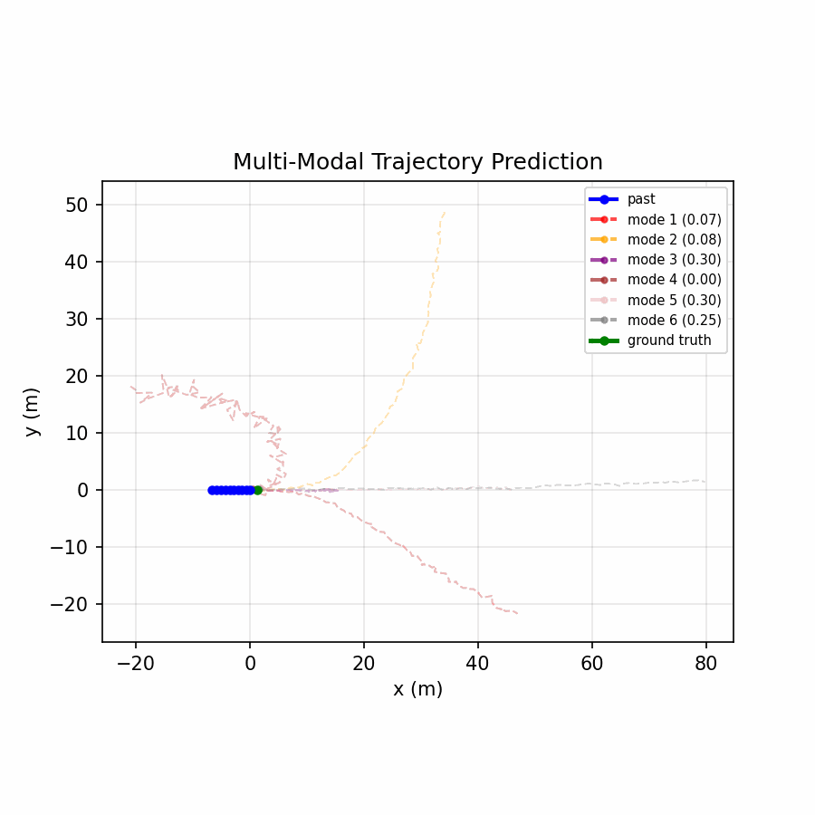
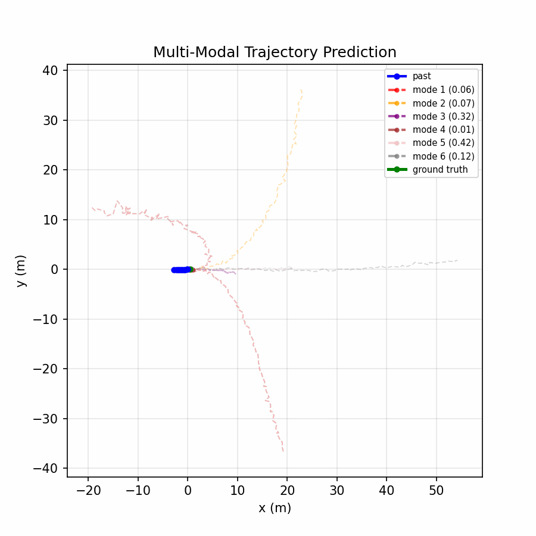
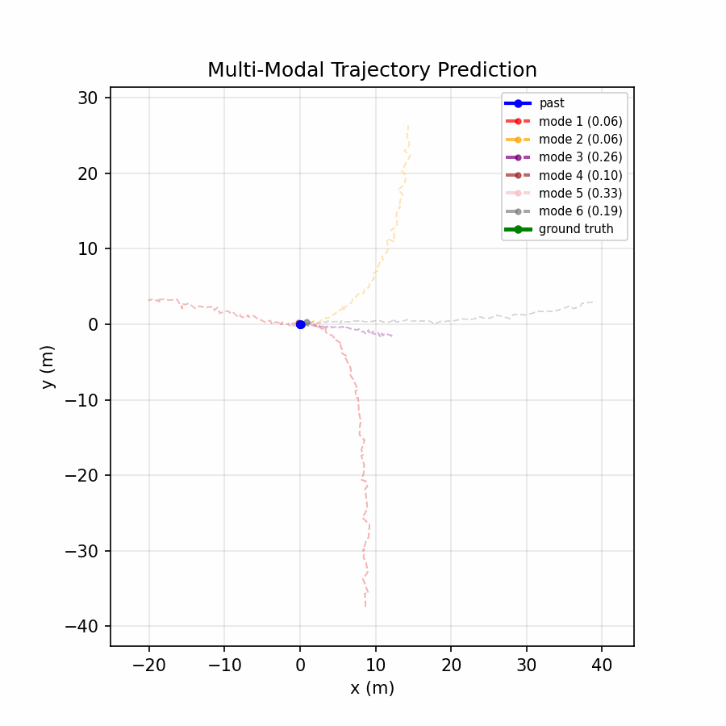

# Waymo Motion Prediction Model

## Project Overview

This project implements trajectory prediction models using the Waymo Open Motion Dataset, aiming to predict an agent's future positions based on its past trajectory. The models take the past 10 (x, y) coordinates of a single agent and predict the next 80 positions (a future horizon of roughly 8 seconds at 10 Hz). This task is crucial for autonomous driving systems, as accurate motion forecasting of vehicles and pedestrians helps in planning and safety.

The project implements two architectures: a single-mode baseline (ConvMLP) and a multi-modal extension (MultiModalConvMLP) that predicts multiple possible future trajectories with associated confidence scores. Both models were trained on trained on 25% of the WOMD training partition (250 TFRecords) using a GPU-accelerated Google Compute Engine VM, streaming data directly from Google Cloud Storage. The models work on individual agent tracks without scene context or map information, demonstrating what can be achieved with purely historical trajectory data.

See Technical Report: [Report](./ConvMLPPaper.pdf)

## Results

### Evaluation Metrics

| Model | Avg Loss | Avg ADE (m) | Avg FDE (m) |
|---|---|---|---|
| ConvMLP | 434.36 | 14.25 | 31.83 |
| MultiModalConvMLP (best-of-6) | 87.35 | 3.85 | 10.32 |

The multi-modal model achieves a **73% reduction in ADE** and **68% reduction in FDE** compared to the baseline, demonstrating the importance of capturing the inherent multi-modality of real-world motion.

### ConvMLP Predictions


### MultiModalConvMLP Predictions





### Training Curves


---

## Model Architectures

### ConvMLP (Baseline)

The ConvMLP is a simple 1D Convolution + MLP neural network:

- **Convolutional Encoder:** Two 1D convolutional layers with causal padding (kernel size 3, 64 filters each) process the past trajectory sequence, extracting local motion features such as velocity and acceleration cues.
- **Flatten Layer:** Converts the encoder output (10×64) into a single vector.
- **MLP Decoder:** A Dense layer (128 units, ReLU) followed by an output Dense layer producing 160 values, reshaped into (80, 2) predicted future coordinates.

**Input/Output:** (10, 2) → (80, 2)

### MultiModalConvMLP

Extends the baseline to predict K=6 possible future trajectories with confidence scores:

- **Shared Encoder:** Same convolutional encoder as baseline (2 Conv1D layers, 64 filters)
- **Shared Features:** Flattened features through a shared 128-unit Dense layer
- **K Trajectory Heads:** 6 separate Dense layers, each predicting one possible (80, 2) future trajectory
- **Confidence Head:** Softmax layer predicting probability distribution over the K modes

**Training Loss:** Winner-takes-all (WTA) strategy combining a control loss (regression on the best-matching trajectory) and an intent loss (cross-entropy encouraging the confidence head to identify the best mode).

**Input/Output:** (10, 2) → trajectories (6, 80, 2) + confidences (6,)

---

## Data Preprocessing

### Waymo Open Motion Dataset

The dataset provides per-agent trajectories with 1 second of history (10 frames) and 8 seconds of future (80 frames) at 10 Hz. Training uses 250 TFRecord files from the full WOMD training partition, streamed directly from Google Cloud Storage via `tf.data.TFRecordDataset`.

### Preprocessing Pipeline (dataLoader.py)

1. Parse TFRecords extracting past/future x, y coordinates and validity masks
2. Filter to agents marked for prediction (`tracks_to_predict`)
3. **Filter to agents with all past timesteps valid** — ensures clean normalization (see note below)
4. Translate last observed position to origin (0, 0)
5. Rotate coordinates so the agent's final heading aligns with the +x axis
6. Apply future validity mask during loss computation and evaluation
7. Split 90/10 into train/validation, batch and prefetch

> **Note on past validity filtering:** An earlier version of the pipeline parsed the past validity mask but did not apply it, allowing agents with partially invalid past trajectories (containing placeholder zeros) into training. This corrupted the coordinate normalization step, which computes translation and rotation from the last observed positions. The fix filters to only fully-observed past trajectories, which was critical to achieving stable predictions.

Each sample consists of: past trajectory (10, 2), future trajectory (80, 2), and a validity mask (80,).

---

## Experiment Configuration

All experiments are managed through YAML configuration files in the `configs/` directory:

```yaml
experiment:
  name: "experiment_name"
  description: "Brief description"

data:
  train_dir: "./training_data"
  test_dir: "./test_data"
  past_steps: 10
  future_steps: 80
  batch_size: 64
  train_split: 0.9

training:
  epochs: 10
  learning_rate: 0.001
  optimizer: "adam"

model:
  name: "ConvMLP"         # or "MultiModalConvMLP"
  num_modes: 6            # MultiModalConvMLP only

logging:
  log_dir: "logs"
  save_dir: "trained_models"
  tensorboard: true
```

---

## Directory Structure

```
WaymoProject/
├── models/
│   ├── ConvMLP.py
│   └── MultiModalConvMLP.py
├── configs/
│   ├── default.yaml
│   ├── multimodal.yaml
│   ├── waymo_public.yaml
│   └── waymo_public_multimodal.yaml
├── config.py
├── dataLoader.py
├── train_model.py
├── evaluate.py
├── metrics.py
├── losses.py
├── visualize.py
├── gcp/
│   ├── gcp_setup.sh
│   └── setup_waymo_data.sh
├── training_data/
├── test_data/
├── logs/
└── trained_models/
```

---

## Usage

### Training

```bash
# Baseline single-mode model
python train_model.py --config configs/default.yaml

# Multi-modal model
python train_model.py --config configs/multimodal.yaml

# Full Waymo dataset on GCP
python train_model.py --config configs/waymo_public.yaml
```

### Evaluation

```bash
python evaluate.py
# Enter "test" for metrics or "vis" for GIF generation
```

### TensorBoard

```bash
tensorboard --logdir logs/
```

---

## Cloud Training (Google Cloud Platform)

```bash
# 1. Edit project ID in gcp_setup.sh
# 2. Run automated setup
chmod +x gcp/gcp_setup.sh && ./gcp/gcp_setup.sh

# 3. SSH into VM
gcloud compute ssh waymo-training-vm --zone=us-west1-b

# 4. Start training
screen -S training
python train_model.py --config configs/waymo_public.yaml
```

---

## Known Limitations

- No map, road graph, or lane context
- Single-agent prediction (no interaction modeling)
- Simple feed-forward architecture (no LSTM/GRU/Transformer)
- Occasional outlier predictions for unusual agent behaviors

## Future Work

- Incorporate map and road graph context as model inputs
- Model agent-agent interactions (social forces, attention mechanisms)
- Explore LSTMs, GRUs, Transformers, and Graph Neural Networks
- Increase number of trajectory modes with improved loss balancing
- Investigate batch size sensitivity for winner-takes-all training at scale

## References

1. Ettinger, S., et al. (2021). "Large Scale Interactive Motion Forecasting for Autonomous Driving: The Waymo Open Motion Dataset." *ICCV*, pp. 9710–9719.
2. Chen, K., et al. (2024). "WOMD-LiDAR: Raw Sensor Dataset Benchmark for Motion Forecasting." *ICRA*.